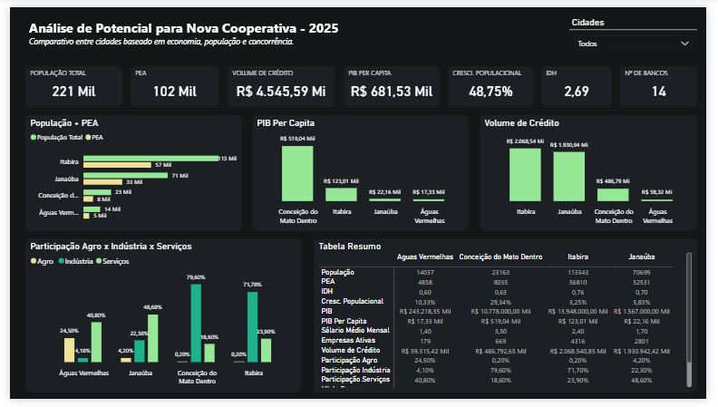

# 📊 Análise de Potencial para Nova Cooperativa - 2025

Este projeto foi desenvolvido como parte de um desafio de análise estratégica para apoiar a decisão de abertura de uma nova agência cooperativa em Minas Gerais. A análise compara quatro cidades candidatas com base em indicadores econômicos, populacionais e de concorrência.

## 🏙️ Cidades analisadas

- Janaúba
- Águas Vermelhas
- Itabira
- Conceição do Mato Dentro

## 🔍 Objetivo

Auxiliar a diretoria na escolha da cidade mais estratégica para inaugurar uma nova agência da cooperativa em 2025, considerando:

- População e população economicamente ativa (PEA)  
- Volume de crédito na cidade  
- PIB per capita  
- Crescimento populacional  
- Número de empresas ativas  
- Setores predominantes da economia (Agro, Indústria, Serviços)  
- Concorrência bancária e cooperativas  

## 📌 Destaques do Dashboard

- **Visual comparativo com filtros interativos** entre as cidades.
- Indicadores principais no topo: População, Volume de Crédito, PIB per Capita etc.
- Gráficos sobre PEA, PIB, volume de crédito e setores econômicos.
- Tabela resumo com todos os indicadores relevantes.
- Filtros por cidade para facilitar a análise.

## ✅ Cidade recomendada: **Janaúba**

Com base nos dados analisados, **Janaúba** se destacou por apresentar:

- Um alto volume de crédito (R$ 1,93 bilhão).
- Mais de 2.800 empresas ativas.
- Crescimento populacional positivo.
- Boa estrutura urbana e presença relevante do setor de serviços.

## 💡 Melhorias Futuras

Caso houvesse mais tempo ou dados disponíveis, seria possível:

- Incluir séries históricas dos indicadores econômicos.
- Estimar a participação de mercado das cooperativas por cidade.
- Avaliar distribuição geográfica dos bancos por bairro/região.
- Aprofundar o perfil dos investidores e o uso de canais digitais.

## 🛠️ Tecnologias Utilizadas

- Power BI Desktop (.pbix)
- Microsoft Excel
- Dados públicos do IBGE e Banco Central

## 📁 Arquivos no repositório

- `dashboard-cooperativa-2025.pbix`: Arquivo editável do Power BI.
- `dashboard.png`: Imagem do dashboard em alta resolução.
- `README.md`: Este documento explicativo.

---

🚀 Sinta-se à vontade para clonar, adaptar ou contribuir com sugestões!
